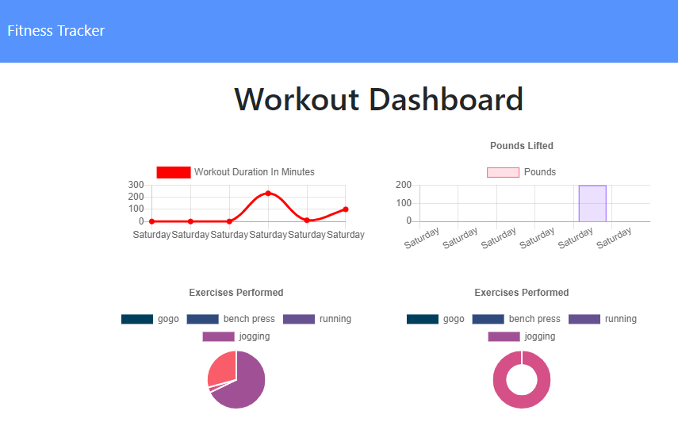
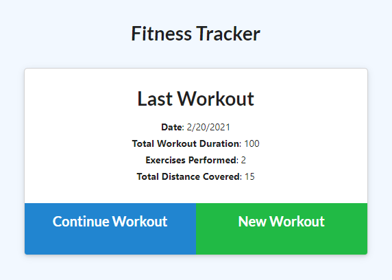

## Workout Tracker

This project uses a mongo database with express routes to let a user create and track workouts. The user is able to add their own workouts and include data such as time, weight, and workout type. 

[Deployed Site](https://intense-everglades-64620.herokuapp.com/)

# Dashboard

# Homepage
